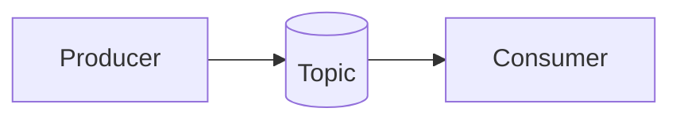
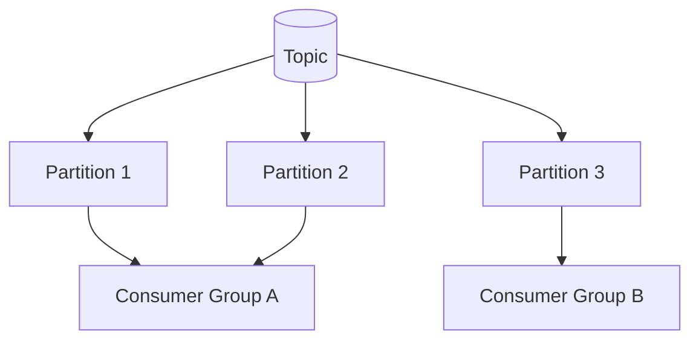

# Kafka: Learning Handbook

A practical, book-style guide to Apache Kafka for beginners, intermediate learners, and interview preparation.

This repository includes multiple chat applications, and this handbook explains how they form a learning path from raw sockets to WebSocket and then to Kafka.

If you want the runnable project documentation, also read [a4-chatapp-kafka-server-client-based/README.md](a4-chatapp-kafka-server-client-based/README.md).

## How To Use This Handbook

Read it in order if Kafka is new to you.

1. Learn the core ideas.
2. Install Kafka locally or with Docker.
3. Practice producer and consumer flow.
4. Move into Java and Spring Boot.
5. Study advanced concepts.
6. Use the interview chapter as revision.

If you already know the basics, jump directly to the chapters you need.

## Table Of Contents

1. Preface
2. What Kafka Is
3. Why Kafka Matters
4. Core Kafka Concepts
5. Installation Guide
6. First Topic, Producer, and Consumer
7. Kafka With Java
8. From WebSocket To Kafka
9. Learning Roadmap
10. Advanced Kafka Topics
11. Best Practices
12. Troubleshooting
13. Exercises
14. Interview Questions and Answers
15. Repository Map
16. Next Steps

## Chapter 1: Preface

Kafka is one of the most important tools in modern distributed systems. It appears in microservices, analytics pipelines, audit systems, event-driven applications, and real-time communication platforms.

The goal of this handbook is not only to explain Kafka, but to help you understand how Kafka fits into a real project.

## Chapter 2: What Kafka Is

Apache Kafka is a distributed event streaming platform.

It is used to:

- publish records
- store streams of data
- consume events in real time
- move data between systems reliably

A simple way to think about Kafka is this:

- producers send events
- Kafka stores the events in topics
- consumers read the events later

## Chapter 3: Why Kafka Matters

Kafka solves common problems in distributed systems.

- It decouples services.
- It handles high throughput.
- It retains messages for replay.
- It scales horizontally.
- It helps systems survive spikes and temporary downtime.

Kafka is useful when direct service-to-service calls become too tightly coupled.

## Chapter 4: Core Kafka Concepts

### Broker

A Kafka broker is a Kafka server. It stores messages and serves producers and consumers.

### Topic

A topic is a named stream of events. Producers write to topics, and consumers read from them.

### Partition

A topic is divided into partitions. Partitions improve parallelism and scale.

### Record

A record is one Kafka message. It often contains a key, value, timestamp, and optional headers.

### Producer

A producer sends data to Kafka.

### Consumer

A consumer reads data from Kafka.

### Consumer Group

Consumers in the same group share the work of reading partitions.

### Offset

An offset is the position of a record inside a partition.

### Replication

Replication copies partitions across brokers for fault tolerance.

### Retention

Kafka keeps data for a configured time or size limit, even after it is consumed.

## Chapter 4B: Visual Models

Seeing Kafka as a picture often makes the concepts easier to remember.

### Producer, Topic, Consumer



### Partitions And Consumer Groups



Main points:

- Topics hold events
- Partitions distribute load and enable parallelism
- Consumer groups share partitions for scaling
- Ordering is guaranteed inside a partition only

## Chapter 5: Installation Guide

There are two practical ways to learn Kafka.

1. Local binary installation
2. Docker-based installation

If you are on Windows, Docker is usually the easiest path. If you want deep understanding, also try local binaries.

### Prerequisites

- Java 17 or newer
- Git
- At least 4 GB RAM
- A terminal such as PowerShell or Windows Terminal

### Official Links

- [Apache Kafka Downloads](https://kafka.apache.org/downloads)
- [Apache Kafka Documentation](https://kafka.apache.org/documentation/)
- [Kafka Quick Start](https://kafka.apache.org/quickstart)
- [Docker Desktop](https://www.docker.com/products/docker-desktop/)
- [Adoptium Java](https://adoptium.net/)

### Local Installation

1. Download Kafka from the official site.
2. Extract it to a folder such as `C:\kafka`.
3. Verify Java:

```bash
java -version
```

4. Start Kafka in KRaft mode.
5. Create topics.
6. Run a consumer and producer.

Example commands on Windows:

```bash
bin\windows\kafka-storage.bat random-uuid
bin\windows\kafka-storage.bat format -t <cluster-id> -c config\kraft\server.properties
bin\windows\kafka-server-start.bat config\kraft\server.properties
```

### Docker Installation

Docker is better for repeatable learning environments.

You can run Kafka with a Docker Compose file and connect to `localhost:9092`.

## Chapter 6: First Topic, Producer, and Consumer

This is the smallest complete Kafka loop.

1. Create a topic.
2. Start a consumer.
3. Start a producer.
4. Send messages.
5. Observe delivery.

Example topic creation:

```bash
bin\windows\kafka-topics.bat --create --topic demo-topic --bootstrap-server localhost:9092 --partitions 3 --replication-factor 1
```

Example consumer:

```bash
bin\windows\kafka-console-consumer.bat --topic demo-topic --from-beginning --bootstrap-server localhost:9092
```

Example producer:

```bash
bin\windows\kafka-console-producer.bat --topic demo-topic --bootstrap-server localhost:9092
```

## Chapter 7: Kafka With Java

Kafka is often used from Java applications.

### Java Producer

```java
Properties props = new Properties();
props.put("bootstrap.servers", "localhost:9092");
props.put("key.serializer", "org.apache.kafka.common.serialization.StringSerializer");
props.put("value.serializer", "org.apache.kafka.common.serialization.StringSerializer");

try (KafkaProducer<String, String> producer = new KafkaProducer<>(props)) {
    ProducerRecord<String, String> record = new ProducerRecord<>("demo-topic", "hello kafka");
    producer.send(record);
    producer.flush();
}
```

### Java Consumer

```java
Properties props = new Properties();
props.put("bootstrap.servers", "localhost:9092");
props.put("group.id", "demo-group");
props.put("enable.auto.commit", "true");
props.put("auto.offset.reset", "earliest");
props.put("key.deserializer", "org.apache.kafka.common.serialization.StringDeserializer");
props.put("value.deserializer", "org.apache.kafka.common.serialization.StringDeserializer");

KafkaConsumer<String, String> consumer = new KafkaConsumer<>(props);
consumer.subscribe(Arrays.asList("demo-topic"));
```

## Chapter 8: From WebSocket To Kafka

This repository already shows a progression of communication styles.

- `a1-chatapp-tcp-based-JSE/` shows raw socket communication.
- `a2-chatapp-websocket-based-JEE/` shows browser-friendly real-time messaging.
- `a3-chatapp-websocket-based-spring-boot/` introduces a framework-driven backend.
- `a4-chatapp-kafka-server-client-based/` adds Kafka and event-driven architecture.

### When WebSocket Is Enough

Use WebSocket when you need a live client connection and simple real-time delivery.

### When Kafka Becomes Better

Use Kafka when:

- multiple services need the same event
- you want to buffer spikes
- you need replay and retention
- producers and consumers should scale independently
- the system must survive temporary downtime without losing events

### Migration Pattern

Keep WebSocket at the edge and move internal message flow to Kafka.

`Browser -> WebSocket -> Kafka Topic -> Consumers -> WebSocket Updates`

This lets the browser stay real-time while Kafka handles durability and fan-out.

## Chapter 9: Learning Roadmap

### Beginner Level

Focus on:

- brokers
- topics
- producers
- consumers
- partitions
- offsets
- consumer groups

Practice:

- create a topic
- send console messages
- read messages from the beginning
- compare key-based routing

### Intermediate Level

Learn:

- partitioning strategies
- consumer rebalancing
- retention policies
- log compaction
- offset commits
- producer acknowledgements

Practice:

- build a Java producer and consumer
- simulate consumer restarts
- compare automatic and manual offset handling

### Advanced Level

Learn:

- replication
- leader election
- idempotent producers
- transactions
- exactly-once semantics
- Kafka Streams
- security with SSL and SASL
- monitoring and tuning

Practice:

- design event-driven services
- add schemas
- measure lag
- test failure recovery

## Chapter 10: Advanced Kafka Topics

### Partition Strategy

Partitioning determines parallelism and ordering. Messages with the same key usually land in the same partition.

### Offset Management

Offsets show how far a consumer has read. Commit strategy affects reliability and recovery.

### Replication and Durability

Replication protects against broker failure.

### Throughput and Backpressure

Kafka can absorb traffic spikes, but consumers still need to keep up.

### Exactly-Once Processing

Use transactions and idempotent writes when duplicates are not acceptable.

### Kafka Streams

Kafka Streams is a library for stream processing over Kafka topics.

### Security

Production Kafka often uses:

- TLS
- SASL
- ACLs

## Chapter 11: Best Practices

- Keep messages small.
- Name topics clearly.
- Choose partition counts carefully.
- Design keys intentionally.
- Monitor lag.
- Use schemas for long-lived contracts.
- Test failure recovery.
- Prefer stateless consumers when possible.

## Chapter 12: Troubleshooting

### Kafka Does Not Start

- Check Java installation.
- Confirm `JAVA_HOME`.
- Verify ports are free.
- Review logs.

### Consumer Sees No Messages

- Confirm producer and consumer use the same topic.
- Check the bootstrap server.
- Use `--from-beginning` during learning.

### Messages Seem Out Of Order

Kafka guarantees ordering only within a partition, not across all partitions.

### Consumer Lag Increases

- scale consumers
- reduce processing time
- add partitions if needed

## Chapter 13: Exercises (Guided)

These exercises are ordered so you can build confidence step-by-step. Each exercise includes a short goal, commands or hints, and what you should observe.

### Exercise 1 — Topic and Console Flow (10–20 min)

Goal: create a topic and verify console producer/consumer work.

Commands (Windows example):

```bash
bin\windows\kafka-topics.bat --create --topic practice-topic --bootstrap-server localhost:9092 --partitions 3 --replication-factor 1
bin\windows\kafka-console-consumer.bat --topic practice-topic --from-beginning --bootstrap-server localhost:9092
bin\windows\kafka-console-producer.bat --topic practice-topic --bootstrap-server localhost:9092
```

What to observe: messages typed into the producer appear in the consumer.

### Exercise 2 — Ordering and Keys (15–30 min)

Goal: understand ordering within partitions.

Approach: send several messages with the same key and others without a key. Note which messages appear together in the console consumer.

What to observe: messages with the same key land in the same partition and preserve order.

### Exercise 3 — Consumer Groups (20–30 min)

Goal: run two consumers in the same consumer group and see partition assignment.

Approach: start two console consumers with the same `--group` flag and a producer that sends multiple messages.

What to observe: partitions are split between consumers so each consumer reads a subset of messages.

### Exercise 4 — Offset Recovery (15–30 min)

Goal: learn about offsets and replay.

Approach: consume some messages, stop the consumer, produce more messages, then restart the consumer (with the same group) and with `--from-beginning` to compare behaviors.

What to observe: depending on commit strategy you may replay or continue from the last committed offset.

### Exercise 5 — Java JSON Producer (30–60 min)

Goal: write a Java producer that sends JSON payloads.

Hints: use `org.apache.kafka.clients.producer.KafkaProducer` with `StringSerializer` for keys and values; build JSON with `jackson-databind` or `org.json`.

What to observe: JSON arrives intact at the consumer and can be parsed.

### Exercise 6 — Design Exercise: Chat with Replay (30–60 min)

Goal: sketch a design where the WebSocket server writes chat messages to Kafka and a consumer service rebroadcasts them to connected clients and stores them in a database for history.

Deliverable: a short diagram and a list of components (producers, topics, consumers, DB, WebSocket broadcaster).

### Exercise 7 — Failure Story (15–30 min)

Goal: write a short failure/recovery scenario: what happens if the producer succeeds but one consumer is down for five minutes?

What to observe: Kafka retains events; when the consumer comes back it can resume reading; consumer lag will increase and should be monitored.

These exercises give practical experience with topics, partitions, consumer groups, offsets, and integrating Kafka with code.

## Chapter 14: Interview Questions And Answers

### 1. What is Kafka?

Kafka is a distributed event streaming platform for publishing, storing, and consuming records.

### 2. Why is Kafka used?

It decouples systems, scales well, and supports durable asynchronous communication.

### 3. What is a topic?

A topic is a named stream of records.

### 4. What is a partition?

A partition is a shard of a topic that improves scale and parallel processing.

### 5. What is a producer?

A producer writes data to Kafka.

### 6. What is a consumer?

A consumer reads data from Kafka.

### 7. What is a consumer group?

A consumer group is a set of consumers that share partition processing.

### 8. What is an offset?

An offset is the record position within a partition.

### 9. Why use Kafka instead of direct HTTP calls?

Kafka decouples services and handles asynchronous communication better.

### 10. Why use Kafka in chat?

It helps fan out messages, persist events, and scale delivery.

### 11. What is the role of WebSocket in the project?

WebSocket gives live browser communication.

### 12. Why use Kafka and WebSocket together?

WebSocket handles the client connection, while Kafka handles internal event flow.

### 13. What is optimistic UI?

It means showing the message immediately before server confirmation.

### 14. What is message deduplication?

It prevents the same message from being rendered twice.

### 15. What is the main advantage of this architecture?

It separates chat delivery from backend processing and supports scaling.

## Chapter 16: Glossary

This glossary collects short definitions for quick review.

- **Broker:** a Kafka server that stores and serves messages.
- **Topic:** a named stream of records.
- **Partition:** a shard of a topic for parallelism.
- **Offset:** a consumer's position in a partition.
- **Consumer group:** a set of consumers sharing partition processing.
- **Retention:** how long Kafka stores data.
- **KRaft:** Kafka mode without ZooKeeper.
- **Idempotent producer:** avoids duplicates on retries.

## Chapter 17: Repository Map

This workspace shows a useful progression:

- `a1-chatapp-tcp-based-JSE/` raw sockets
- `a2-chatapp-websocket-based-JEE/` browser WebSocket learning
- `a3-chatapp-websocket-based-spring-boot/` Spring Boot chat architecture
- `a4-chatapp-kafka-server-client-based/` Kafka-backed real-time chat

That progression makes the learning journey practical instead of abstract.

## Chapter 18: Next Steps

If you want to continue, the best next improvements are:

- add diagrams for Kafka partitions and consumer groups
- add more Java examples for producers and consumers
- add exercises with answers
- add a mini glossary at the end (done)
- add project screenshots

## Closing Notes

Kafka becomes easier when you connect it to a real problem.

This repository helps you do that by showing how the same chat system evolves from sockets to WebSocket and finally to Kafka.

Study the concepts first, then the examples, then the interview questions. That is the fastest way to learn it well.

## Artifacts Added

I added supporting artifacts to help practice and share the handbook:

- Diagrams: `assets/diagrams/partitions.svg` (visual partition/consumer-group model)
- Exercise answers and runnable samples: `docs/exercise-answers.md`
- Java samples: `samples/java/JsonProducer.java`, `samples/java/JsonConsumer.java`
- Node sample: `samples/node/package.json`, `samples/node/index.js` (uses `kafkajs`)
- PDF generation scripts: `scripts/generate_pdf.ps1`, `scripts/generate_pdf.sh` (use `pandoc` + LaTeX)

To run the node sample:

```bash
cd samples/node
npm install
node index.js
```

To build and run the Java samples, add `kafka-clients` to your build (Maven/Gradle) and run the classes.

To produce a PDF (requires Pandoc + LaTeX):

PowerShell:

```powershell
.
./scripts/generate_pdf.ps1
```

WSL / Linux / macOS:

```bash
./scripts/generate_pdf.sh
```
