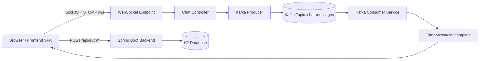
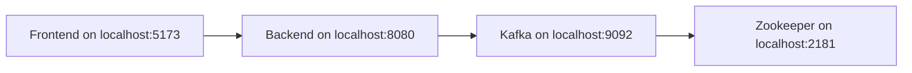
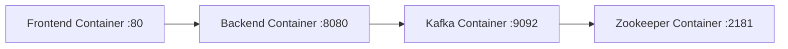
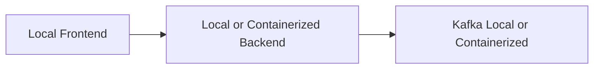

# A4 ChatApp Kafka Server-Client Based

[](https://www.oracle.com/java/technologies/javase/jdk17-archive-downloads.html)
[](https://spring.io/projects/spring-boot)
[](https://kafka.apache.org/)
[](https://vitejs.dev/)
[](https://docs.docker.com/compose/)

## Table of Contents

- [Project Overview](#project-overview)
- [How It Works](#how-it-works)
- [Architecture](#architecture)
- [Features](#features)
- [Technology Stack](#technology-stack)
- [Project Structure](#project-structure)
- [Prerequisites](#prerequisites)
- [Local Development](#local-development-without-docker)
- [Docker Compose Deployment](#docker-compose-deployment)
- [Hybrid Development Modes](#hybrid-development-modes)
- [Kafka Configuration](#kafka-configuration)
- [Environment Configuration](#environment-configuration)
- [Common Commands](#common-commands)
- [Troubleshooting](#troubleshooting)
- [Production Deployment](#production-deployment)
- [Contributing](#contributing)
- [License](#license)

## Project Overview

A4 ChatApp Kafka Server-Client Based is a full-stack real-time chat application built around event-driven communication. Users can sign up, log in, join a room, and exchange messages that are delivered instantly through WebSocket/STOMP and Kafka.

The backend is a Spring Boot service that handles authentication, WebSocket messaging, Kafka publishing, and Kafka consumption. The frontend is a Vite-based single-page app served through Nginx in Docker and connected to the backend through `/api` and `/ws` endpoints. Apache Kafka provides the asynchronous event backbone, while Zookeeper coordinates the broker when Kafka is run in the classic distributed setup used by this project.

This repository supports two primary operating styles:

- local development without Docker
- Docker Compose deployment for the full stack

It also supports hybrid setups when Kafka networking is configured correctly.

## How It Works

1. A user signs up or logs in through the frontend.
2. Spring Security and JWT protect the REST and WebSocket channels.
3. The frontend connects to `/ws` using SockJS and STOMP.
4. Messages are sent to the backend over WebSocket.
5. The backend publishes chat events to Kafka.
6. A Kafka consumer receives the event and rebroadcasts it to the room topic.
7. Connected clients receive the update in real time.

## Architecture

### High-Level Flow



### Local Mode



### Docker Mode



### Hybrid Mode



> **Note:** Hybrid Kafka networking only works when the broker advertises an address that the backend can actually reach. See [Kafka Configuration](#kafka-configuration).

## Features

- Real-time messaging with WebSocket and STOMP
- Kafka-backed event streaming for decoupled message delivery
- JWT-based authentication and authorization
- Room-based chat subscriptions
- Dockerized deployment with Docker Compose
- Scalable service separation between UI, API, and messaging
- Responsive frontend suitable for desktop and mobile layouts
- H2 database for lightweight local persistence and quick development

## Technology Stack

### Frontend

- Vite for development and build tooling
- TypeScript for type safety
- Lit for the component-based SPA in this repository
- SockJS and STOMP for WebSocket connectivity
- Nginx for production serving in Docker

### Backend

- Spring Boot 3.x
- Spring Web
- Spring Security
- Spring WebSocket
- Spring Kafka
- Spring Data JPA
- H2 database

### Messaging

- Apache Kafka
- Apache Zookeeper
- Kafka producer/consumer pattern

### Containerization

- Docker
- Docker Compose
- Nginx reverse proxy

### Build Tools

- Maven 3.9+
- npm
- TypeScript compiler
- Vite build pipeline

## Project Structure

Generated output folders such as `backend/target/` and `frontend/dist/` are omitted below because they are build artifacts.

```text
.
├── docker-compose.yml
├── README.md
├── backend/
│   ├── Dockerfile
│   ├── pom.xml
│   └── src/
│       └── main/
│           ├── java/
│           │   └── com/example/chatapp/
│           │       ├── ChatApplication.java
│           │       ├── config/
│           │       │   ├── KafkaTopicConfig.java
│           │       │   ├── SecurityConfig.java
│           │       │   └── WebSocketConfig.java
│           │       ├── controller/
│           │       │   ├── AuthController.java
│           │       │   └── ChatController.java
│           │       ├── dto/
│           │       │   ├── ChatMessage.java
│           │       │   ├── JwtResponse.java
│           │       │   ├── LoginRequest.java
│           │       │   └── SignupRequest.java
│           │       ├── entity/
│           │       │   └── User.java
│           │       ├── repository/
│           │       │   └── UserRepository.java
│           │       ├── security/
│           │       │   ├── JwtAuthFilter.java
│           │       │   ├── JwtChannelInterceptor.java
│           │       │   └── JwtUtils.java
│           │       └── service/
│           │           ├── KafkaConsumerService.java
│           │           └── KafkaProducerService.java
│           └── resources/
│               └── application.yml
└── frontend/
    ├── Dockerfile
    ├── index.html
    ├── nginx.conf
    ├── package.json
    ├── package-lock.json
    ├── tsconfig.json
    ├── vite.config.ts
    └── src/
        ├── chat-app.ts
        ├── chat-page.ts
        ├── login-page.ts
        ├── main.ts
        └── shim.ts
```

### Directory Purpose

- `backend/`: Spring Boot API, WebSocket gateway, Kafka producer, and Kafka consumer
- `frontend/`: Browser UI, Vite development server, and Nginx production image
- `docker-compose.yml`: Orchestrates Zookeeper, Kafka, backend, and frontend together
- `backend/src/main/resources/`: Spring Boot runtime configuration
- `frontend/src/`: UI components, app bootstrap, and browser compatibility code

## Prerequisites

Before running the application, install the following:

- Java 17 or later
- Maven 3.9 or later
- Node.js 20 or later
- Docker Desktop
- Docker Compose

> **Tip:** If you plan to run only the local mode, Docker is still useful for Kafka, but it is not required for the application itself.

## Local Development Without Docker

This mode runs each service directly on your machine.

### 1) Start Zookeeper

From your Kafka installation directory, start Zookeeper first.

Windows:

```powershell
bin\windows\zookeeper-server-start.bat config\zookeeper.properties
```

Unix/macOS:

```bash
bin/zookeeper-server-start.sh config/zookeeper.properties
```

Expected URL:

- `localhost:2181`

### 2) Start Kafka

After Zookeeper is running, start Kafka.

Windows:

```powershell
bin\windows\kafka-server-start.bat config\server.properties
```

Unix/macOS:

```bash
bin/kafka-server-start.sh config/server.properties
```

For local development, Kafka must be reachable at `localhost:9092`.

> **Warning:** If Kafka advertises the wrong host or port, the backend may connect initially and then fail when the broker returns connection metadata. See the Kafka configuration section below.

### 3) Configure Spring Boot for `localhost:9092`

The repository already defaults to `localhost:9092` in `backend/src/main/resources/application.yml`.

If you want to override it temporarily, set an environment variable before starting the backend:

Windows PowerShell:

```powershell
$env:SPRING_KAFKA_BOOTSTRAP_SERVERS='localhost:9092'
```

Windows CMD:

```cmd
set SPRING_KAFKA_BOOTSTRAP_SERVERS=localhost:9092
```

### 4) Start the Backend

```powershell
cd backend
mvn spring-boot:run
```

Expected URLs:

- Backend: `http://localhost:8080`
- H2 console: `http://localhost:8080/h2-console`

### 5) Start the Frontend

```powershell
cd frontend
npm install
npm run dev
```

Expected URL:

- Frontend: `http://localhost:5173`

### 6) Verify the Application

1. Open `http://localhost:5173`.
2. Sign up a new user.
3. Log in with the same user.
4. Open a second tab or private window.
5. Sign up or log in with another user.
6. Join the same room, such as `lobby`.
7. Send messages from both sides.
8. Confirm that messages appear in real time.

### Expected Endpoints

- REST login: `/api/auth/login`
- REST signup: `/api/auth/signup`
- WebSocket endpoint: `/ws`
- Chat topic: `/topic/chat.{roomId}`

## Docker Compose Deployment

This is the easiest way to run the full stack consistently.

### 1) Build Containers

```powershell
docker compose build
```

### 2) Start Services

```powershell
docker compose up --build
```

Or start detached:

```powershell
docker compose up -d --build
```

### 3) Check Running Containers

```powershell
docker ps
```

You should see containers for Zookeeper, Kafka, backend, and frontend.

### 4) Verify Frontend and Backend

- Frontend: `http://localhost`
- Backend: `http://localhost:8080`
- H2 console: `http://localhost:8080/h2-console`

### 5) View Logs

```powershell
docker compose logs
```

For a specific service:

```powershell
docker compose logs backend
docker compose logs kafka
docker compose logs frontend
docker compose logs zookeeper
```

### 6) Stop Services

```powershell
docker compose down
```

### 7) Clean Containers, Networks, and Volumes

```powershell
docker compose down -v
```

> **Tip:** Use `-v` when you want to reset Kafka data and start with a clean state.

## Hybrid Development Modes

Hybrid setups are useful when you want to debug one layer locally while leaving the rest containerized.

### Mode 1: Local Frontend + Local Backend + Docker Kafka

Use this when you want to iterate quickly on UI and API code but keep Kafka isolated in Docker.

Requirements:

- Local backend must connect to a host-accessible Kafka broker
- Kafka must advertise an address the backend can reach, usually `localhost:9092`

Typical backend setting:

```text
SPRING_KAFKA_BOOTSTRAP_SERVERS=localhost:9092
```

> **Note:** A Kafka container that only advertises `kafka:9092` is not enough for a host-run backend. It must also expose a host-reachable listener.

### Mode 2: Local Frontend + Docker Backend + Docker Kafka

Use this when you want to keep the browser UI local while validating the backend and messaging stack in containers.

Requirements:

- Backend container must expose port `8080`
- Frontend must proxy to `http://localhost:8080`

This repository already supports that pattern through the Vite proxy in development and the Docker port mapping in Compose.

### When Each Mode Is Useful

- Local frontend + local backend + local Kafka: fastest debugging of all code on your machine
- Local frontend + Docker backend + Docker Kafka: good for validating backend container behavior
- Full Docker Compose: best for consistent demos, onboarding, and integration testing

## Kafka Configuration

Kafka networking is the most important part of this project because it determines whether the backend can actually produce and consume messages.

### `localhost:9092`

Use `localhost:9092` when the backend is running on your machine and Kafka is reachable from the host network.

This is the default in `backend/src/main/resources/application.yml`:

```yaml
spring:
  kafka:
    bootstrap-servers: ${SPRING_KAFKA_BOOTSTRAP_SERVERS:localhost:9092}
```

### `kafka:9092`

Use `kafka:9092` when the backend runs inside the same Docker Compose network as the Kafka container.

That value works only inside the Docker network because `kafka` is a Compose service name, not a DNS name on your host machine.

### Local vs Docker Networking

- Local mode uses host networking, so services talk through `localhost`
- Docker Compose mode uses an internal bridge network, so services talk through service names such as `kafka` and `backend`

### `KAFKA_ADVERTISED_LISTENERS`

Kafka returns its reachable address to clients using advertised listeners.

- For Docker-to-Docker communication, the broker can advertise `kafka:9092`
- For host-to-Docker communication, the broker must also advertise a host-reachable listener such as `localhost:9092`

If the advertised listener is wrong, your backend may connect, then fail as soon as Kafka redirects it to an unreachable address.

### `SPRING_KAFKA_BOOTSTRAP_SERVERS`

This environment variable overrides the Spring Boot Kafka bootstrap server list.

Examples:

```powershell
$env:SPRING_KAFKA_BOOTSTRAP_SERVERS='localhost:9092'
```

```powershell
$env:SPRING_KAFKA_BOOTSTRAP_SERVERS='kafka:9092'
```

## Environment Configuration

Spring Boot supports both `application.properties` and `application.yml`. This repository currently uses `application.yml`, but the same structure can be split into profile-specific files if needed.

### Recommended Configuration Pattern

- `application.yml`: shared defaults
- `application-local.properties` or `application-local.yml`: local host settings
- `application-docker.properties` or `application-docker.yml`: container settings

### Spring Profiles

Spring profiles let you activate different settings for different environments.

Examples:

```powershell
$env:SPRING_PROFILES_ACTIVE='local'
```

```powershell
$env:SPRING_PROFILES_ACTIVE='docker'
```

### Practical Notes

- Use local profiles for `localhost:9092`, local H2 settings, and direct browser access
- Use Docker profiles for `kafka:9092`, Compose service names, and container-friendly networking

> **Tip:** If you add profile files later, keep the shared defaults in one base file and only override environment-specific values.

## Common Commands

```powershell
docker compose up --build
docker compose up -d
docker compose down
docker compose down -v
docker compose logs
docker ps
docker images
```

Additional useful commands:

```powershell
docker compose logs backend
docker compose logs kafka
docker compose logs frontend
docker compose logs zookeeper
```

## Troubleshooting

### Kafka Not Starting

Possible fixes:

- Check that Zookeeper is running first
- Confirm port `2181` is free
- Confirm port `9092` is free
- Review Kafka logs for listener and broker ID errors

### Zookeeper Configuration Errors

Possible fixes:

- Verify `ZOOKEEPER_CLIENT_PORT=2181`
- Ensure the Zookeeper container can write to its data directory
- Restart the stack with `docker compose down -v` if old volumes are corrupt

### Kafka Advertised Listeners Issues

Symptoms:

- Backend connects briefly, then disconnects
- Producer or consumer cannot resolve the broker after the first metadata request

Fixes:

- Use a host-reachable listener for local development
- Use `kafka:9092` only inside Docker Compose networking
- Make sure `KAFKA_ADVERTISED_LISTENERS` matches the actual client location

### Backend Cannot Connect to Kafka

Possible fixes:

- Confirm `SPRING_KAFKA_BOOTSTRAP_SERVERS` is set correctly
- Confirm Kafka is reachable at the configured host and port
- Check whether the backend is running on the host or inside Docker
- Make sure the broker address advertised by Kafka is resolvable from the backend

### Docker Desktop WSL Issues

Possible fixes:

- Restart Docker Desktop
- Make sure WSL integration is enabled
- Check that your distro has access to Docker resources
- Rebuild images after restarting Docker

### Port Conflicts

Common ports used by this project:

- `80` for frontend in Docker
- `8080` for backend
- `5173` for frontend dev server
- `9092` for Kafka
- `2181` for Zookeeper

Possible fixes:

- Stop the process using the port
- Change the mapping in `docker-compose.yml`
- Restart the stack after freeing the port

### Container Networking Issues

Possible fixes:

- Use service names inside Docker Compose, not `localhost`
- Use `localhost` from the host machine, not a container service name
- Check that the backend and Kafka containers are on the same Compose network

## Production Deployment

This project is a strong starting point for production deployment, but a few production concerns should be addressed before going live.

### Render Deployment Considerations

- Deploy the backend as a web service or containerized app
- Use managed Kafka if the platform supports it
- Move secrets and JWT keys into environment variables
- Replace in-memory or demo-only storage with a production database

### VPS Deployment

- Run backend, frontend, and Kafka on separate services or containers
- Use systemd or Docker Compose to manage service startup
- Persist Kafka data on a durable volume
- Monitor CPU, memory, and disk usage carefully

### Reverse Proxy with Nginx

- Terminate TLS at the proxy layer
- Route `/api` and `/ws` to the backend
- Serve the frontend as static content
- Keep WebSocket upgrade headers enabled

### SSL Setup

- Use a valid certificate from a trusted CA
- Redirect HTTP to HTTPS
- Make sure WebSocket clients use `wss://` in secure environments

### External Kafka Services

- Consider managed Kafka for production reliability
- Update `SPRING_KAFKA_BOOTSTRAP_SERVERS` to the provider endpoint
- Configure TLS, authentication, and ACLs if required

### CI/CD Overview

A practical CI/CD flow usually includes:

1. Build and test the backend
2. Build the frontend
3. Build Docker images
4. Push images to a registry
5. Deploy Compose or platform manifests
6. Run smoke checks against `/api`, `/ws`, and the UI

## Contributing

Contributions are welcome.

Suggested workflow:

1. Fork the repository.
2. Create a feature branch.
3. Make focused changes with clear commit messages.
4. Test both local and Docker modes when your change affects runtime behavior.
5. Open a pull request with a short summary and validation notes.

## License

No explicit license is currently declared in this repository.

If you intend to publish or distribute the project, add a `LICENSE` file with the license terms you want to apply.