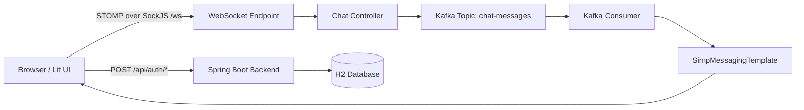

# Kafka Chat App

Real-time chat application built with Spring Boot, Apache Kafka, Lit, JWT authentication, STOMP over SockJS, H2, Maven, Nginx, and Docker Compose.

## Preface

This document is written like a practical handbook. It explains not only how to run the project, but also why each piece exists, how the parts talk to each other, and what a learner should remember for interviews.

If you want the wider Kafka theory guide, also see [../README.md](../README.md).

## How To Read This Guide

If you are a beginner, read it in order.

1. Start with the architecture and the story of the app.
2. Then learn the setup and run steps.
3. After that, study the file-by-file walkthrough.
4. Finally, use the interview section as revision notes.

If you already know Kafka, you can jump directly to the chapters that interest you.

## Chapter 1: What This Project Is

This is a real-time chat system where users can sign up, log in, join a room, and send messages that reach other users immediately.

The interesting part is the message path:

- the browser sends chat text over STOMP
- the backend secures the request with JWT
- the backend publishes the message to Kafka
- a Kafka consumer rebroadcasts the message to the room topic
- connected clients receive the update in real time

So this is not just a chat app. It is a small example of event-driven architecture in action.

## Chapter 2: What You Learn From It

This project teaches several important ideas at the same time:

- how to build login and signup APIs
- how JWT protects a system without server sessions
- how WebSocket keeps a connection open for live updates
- how STOMP organizes real-time messages
- how Kafka decouples the sender from the receiver
- how a frontend can feel instant using optimistic UI
- how Docker Compose turns a multi-service system into one command

## Chapter 3: The System Architecture



Think of the architecture as two layers:

- **control layer:** signup, login, token creation, and security
- **message layer:** websocket send, Kafka publish, Kafka consume, and room broadcast

That separation is one reason the design is easy to understand and scale.

## Chapter 4: Technology Choices

### Backend

Spring Boot is used because it gives a fast, opinionated way to build secure Java services.

- Spring Security protects REST and WebSocket access
- Spring WebSocket handles live communication
- Spring Kafka connects the app to Kafka topics
- JPA and H2 keep the data layer simple for learning

### Frontend

Lit is used because it is lightweight and easy to reason about.

- TypeScript improves safety
- Vite gives a fast development loop
- STOMP and SockJS connect the UI to the backend

### Infrastructure

Docker Compose is used to keep the learning environment repeatable.

- Kafka runs in a container
- Backend runs in a container
- Frontend runs in a container behind Nginx

## Chapter 5: Project Structure

- [backend/](backend/) Spring Boot application
- [frontend/](frontend/) Lit frontend and Nginx config
- [docker-compose.yml](docker-compose.yml) local orchestration for Kafka, backend, and frontend

## Chapter 6: How The Message Flows

### Step 1: A user logs in

`POST /api/auth/login` returns a JWT. The frontend stores it in memory.

### Step 2: The WebSocket connects

The frontend opens `/ws` using SockJS and sends the JWT in the STOMP CONNECT headers.

### Step 3: A message is sent

The user types a message and sends it to `/app/chat.send`.

### Step 4: The backend processes it

The backend fills in the sender, room, and timestamp, then sends the event to Kafka.

### Step 5: The room receives it

The Kafka consumer publishes the same message to `/topic/chat.{roomId}`.

### Step 6: The frontend renders it

The Lit UI subscribes to the room topic and shows the message.

This is the core story of the project.

## Chapter 7: Key Features

- JWT-secured authentication
- Room-based chat rooms
- Kafka-backed message pipeline
- Optimistic UI so messages appear instantly
- Message deduplication with `messageId`
- H2 console for quick inspection
- Dockerized local environment

## Chapter 8: API Endpoints

### REST

- `POST /api/auth/signup`
- `POST /api/auth/login`

### WebSocket / STOMP

- WebSocket endpoint: `/ws`
- Send message: `/app/chat.send`
- Subscribe to room: `/topic/chat.{roomId}`

### Useful URLs

- Frontend: `http://localhost`
- Backend: `http://localhost:8080`
- H2 console: `http://localhost:8080/h2-console`

## Chapter 9: Step-by-Step Learning Path

### 1. Learn the problem first

Real-time chat is hard because messages must be delivered quickly, securely, and to the right people.

### 2. Learn authentication

You first create users, hash passwords, and return JWTs after login.

### 3. Learn WebSocket and STOMP

WebSocket keeps the channel open. STOMP gives structure to messages and subscriptions.

### 4. Learn Kafka basics

Kafka acts as the event backbone. Producers write to topics. Consumers read from them.

### 5. Connect WebSocket to Kafka

The chat message enters through STOMP and leaves through Kafka.

### 6. Learn frontend state handling

The UI shows the message immediately, then deduplicates future Kafka echoes using `messageId`.

### 7. Learn Dockerization

Docker makes the entire system portable and easy to run.

### 8. Learn production thinking

You learn how to handle broker downtime, startup order, and multiple users.

## Chapter 10: Local Setup

### Prerequisites

- Java 17+
- Node.js 18+
- Docker Desktop
- Docker Compose

### Open the project

```bash
cd a4-chatapp-kafka-server-client-based
```

## Chapter 11: Run With Docker Compose

This is the recommended path for most users.

```bash
docker compose up --build
```

What this does:

- starts Kafka
- starts the backend
- starts the frontend
- links the services together

Then open:

```text
http://localhost
```

## Chapter 12: Run Without Docker

This section is for learning each layer separately.

### Start Kafka

Run Kafka locally or in Docker and make sure it is available at `localhost:9092`.

### Start the backend

```bash
cd backend
./mvnw spring-boot:run
```

On Windows:

```bash
cd backend
mvnw.cmd spring-boot:run
```

### Start the frontend

```bash
cd frontend
npm install
npm run dev
```

### Point the backend to another Kafka address

```bash
SPRING_KAFKA_BOOTSTRAP_SERVERS=host:port
```

## Chapter 13: How To Test The App

1. Open the app in one browser tab.
2. Sign up a new user.
3. Log in.
4. Open a second tab or incognito window.
5. Sign up and log in with another user.
6. Join the same room, usually `lobby`.
7. Send messages from both sides.
8. Confirm that the messages appear in real time.

## Chapter 14: Folder Guide

### Backend

- `controller/` REST and chat controllers
- `config/` WebSocket, Kafka topic, and security config
- `dto/` request and response objects
- `entity/` database entities
- `repository/` JPA repositories
- `security/` JWT helpers and filters
- `service/` Kafka producer and consumer logic

### Frontend

- `chat-app.ts` application shell
- `chat-page.ts` main chat room UI
- `login-page.ts` login and signup UI
- `main.ts` bootstrap entry
- `shim.ts` browser compatibility shim

## Chapter 15: Configuration Notes

- The default room is `lobby`
- Kafka topic used by the app is `chat-messages`
- Backend port is `8080`
- Frontend is served on `80` in Docker
- The frontend Nginx config proxies `/api` and `/ws` to the backend

## Chapter 16: Troubleshooting

- **Page does not load:** Confirm Docker Desktop is running and port `80` is free
- **Login fails:** Sign up first, then log in with the same credentials
- **Messages do not show:** Check browser dev tools and backend logs
- **Kafka unavailable:** Start Kafka or use Docker Compose
- **SockJS error about `global`:** Refresh after the frontend build; the project includes a browser shim
- **Backend starts but Kafka is down:** The app can still boot, but Kafka persistence is unavailable until the broker is reachable

## Chapter 17: Advanced Topics Covered By This Project

- Event-driven architecture
- Loose coupling between services
- Message durability and replay
- Consumer groups and scaling
- STOMP destinations and subscriptions
- JWT-based access control
- Optimistic UI design
- Container orchestration

## Chapter 18: Interview Questions and Answers

### 1. What is Apache Kafka?

Kafka is a distributed event streaming platform used to publish, store, and consume records in real time.

### 2. Why is Kafka used in this project?

It decouples message production from delivery, improves scalability, and makes chat message flow more reliable.

### 3. What is a Kafka topic?

A topic is a named stream where producers write events and consumers read them.

### 4. What is a producer?

A producer sends data to Kafka.

### 5. What is a consumer?

A consumer reads data from Kafka.

### 6. What is the role of WebSocket here?

WebSocket keeps a live connection open so chat updates can reach users instantly.

### 7. Why use STOMP on top of WebSocket?

STOMP adds a simple message protocol with destinations, subscriptions, and headers.

### 8. Why use SockJS?

SockJS provides browser-friendly fallback support for the WebSocket transport.

### 9. Why use JWT?

JWT lets the frontend prove the user is authenticated without keeping server sessions.

### 10. Where is the JWT used?

It is used for REST login/session flow and also sent in the STOMP CONNECT headers.

### 11. Why use H2 in this project?

H2 is lightweight and ideal for demos, learning, and quick local testing.

### 12. Why is Docker Compose useful here?

It starts Kafka, backend, and frontend together with one command.

### 13. What is optimistic UI?

It means showing the message immediately before server confirmation to make the app feel faster.

### 14. Why do we need `messageId`?

It helps prevent duplicate rendering when the same message appears from both local UI and Kafka broadcast.

### 15. What is the advantage of room-based topics?

Each room can receive only its own messages, which keeps subscriptions organized and scalable.

### 16. What happens if Kafka is down?

The backend can still start, but Kafka-backed persistence and replay are not available until Kafka comes back.

### 17. What is the difference between REST and WebSocket?

REST is request-response, while WebSocket is a persistent bidirectional connection.

### 18. What is the main learning takeaway from this project?

How authentication, messaging, and real-time delivery work together in a modern distributed app.

## Chapter 19: Common Interview Follow-Ups

- How would you scale this chat app?
- How would you store chat history permanently?
- How would you add read receipts?
- How would you support many rooms and millions of messages?
- How would you secure WebSocket connections in production?

## Chapter 20: Next Learning Steps

- Add message persistence in a real database
- Add user presence and typing indicators
- Add pagination for older messages
- Add Kafka partitions and consumer groups for scale testing
- Add tests for REST, WebSocket, and Kafka flows

## Chapter 21: Related Files

- [backend/pom.xml](backend/pom.xml)
- [backend/src/main/resources/application.yml](backend/src/main/resources/application.yml)
- [docker-compose.yml](docker-compose.yml)
- [frontend/package.json](frontend/package.json)

## Closing Notes

This project is intentionally small enough to understand, but complete enough to teach real architecture.

If you study it carefully, you will learn:

- how a secure real-time system is structured
- how Kafka fits into an application
- how frontend and backend coordinate in real time
- how to explain the design in an interview